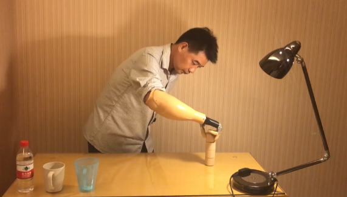

# My Projects
* * *
[_**Bionic Prostheses Research supported by NSFC**_](https://www.youtube.com/watch?v=pflYb0izIks)

content

 

* * *
[_**sEMG based HMI support by National Key R&D Plan**_](https://www.youtube.com/watch?v=pGgMdULWBn0)

content

* * *
[_**2019.3 R&D of Robotic Hand for Science Exhibits**_](https://www.youtube.com/watch?v=pGgMdULWBn0)

content

* * *
[_**2018.5 R&D of a Multi-finger Prosthetic Hand**_](https://www.youtube.com/watch?v=pflYb0izIks)

This is a self-designed myoelectric controlled prosthesis. The sEMG is collected from the right stump limb by a MYO, the left limb is attached with a vibrator which indicated the force and hand aperture information. The total training time is less than 20 min, this video showed great stability compared with the state of art in pattern recognition based prosthesis.|

 

* * *
[_**2015.3 R&D of a two-wheeled motorized personal vehicle**_](https://www.youtube.com/watch?v=EZ2f1EtyZls)

After the Freescale cup car racing competition, my tutor suggested building a two-wheeled car for carrying a person, just like segway. I bought the mechanical framework and two DC brush motors, but the remaining I need to figure out by myself. This was also my first time to design both the software and hardware. One of the core issues is the design of motor driver. I built a full-bridge MOSFET for driving DC brush motor. At the beginning, the MOSFET are easily burnt out, I dived into the principle of circuit and changed many plans, but producing little effect.After asking my engineer uncle and a warm-hearted friend Slloyd, I adjusted the weight distribution of the car, making it much balanced between front and back. Then I added a reliable heat dissipation on all MOSFET (this is also my first moment to realize the importance of heat dissipation), It finally worked normal.

* * *
[_**2014.7 R&D of CV based autonomous two-wheeled car**_](https://www.youtube.com/watch?v=Ga9hf_LiJlc)

In the summer of 2014, when I was a second-year undergraduate student, I took part in a national competition where every school designed a little car that can autonomously driving along the road. Cars are mainly divided into three groups, each year the organizer would set some rules to increase difficulties. We were the group of CMOS camera based two-wheeled car, the other two groups are linear-CCD based four-wheeled car and electromagnetic based four-wheeled car. In this project, I was in charge of the balance control and speed control of the car. I dived into it from Nov 2013 to July 2014, knowing how to use PID, and how to program the Freescale MCU for peripherals interaction. Meanwhile, I obtained many truths from numerous failures. The most impressive I always remembered was that a two-wheeled car with lower gravity center, lighter weight and more powerful motor, is much easier to control, so a good mechanical design relieves much pressure from control algorithm.

