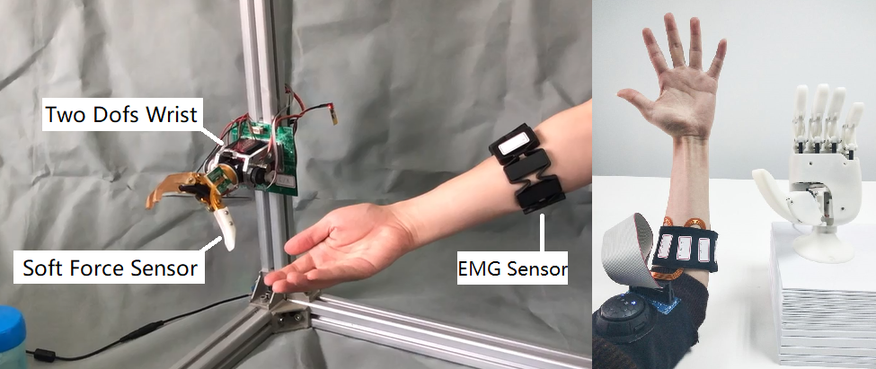
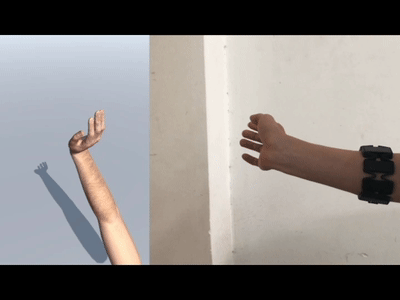
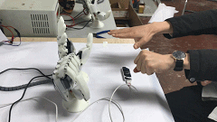
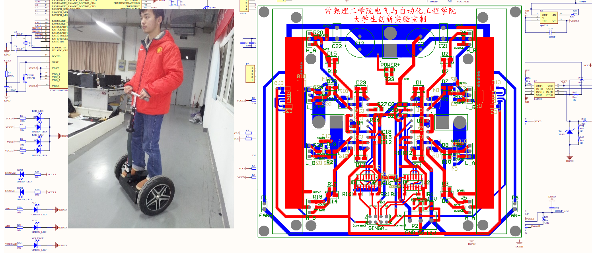
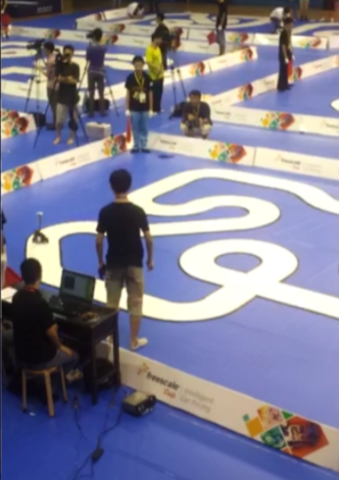

#  _**My Projects**_ &nbsp;    [Press](./press.md) &nbsp;    [About Me](./about_me.md)
* * *
[_**Bionic Prostheses Research supported by NSFC since 2016**_](https://www.nature.com/articles/d42473-019-00174-9?from=timeline&isappinstalled=0)

In the previous research basis of <i>Multi-finger Prosthetic Hand</i>, I Found those additional active DOFs on fingers contributed less on daily activitites, while an active wrist will help them a lot in many scenarios such as drinking, reaching and picking coins. One of the presentations addressed by Prof. Dario Farina demonstrated a wonderful <a href="https://www.youtube.com/watch?v=Gg7fvGNRc7g&t=1660s&pbjreload=101">grasping experiment（22：47）</a> , intuitively proving the importance of a multi-DOFs wrist for a bionic prosthetic hand. In the part of bio-signal sensing, a MYO armband is less suitable for amputees, because it's not easy to fasten it with the prosthetic socket, making the sEMG sensor easily separate from the skin. Therefore I designed a soft and thin electrode array, decreasing the interference from electrode contact condition. 

The related research of this project is reported by <b>nature research</b>, and other research groups of my tutor's lab were included as well. This project is still in progress, because it still lacks a reliable sensation feedback. I believe a close loop between motor and sensation is essential to control the robot hand with proprioception. Meanwhile the intention recognition is still challenging, my future research direction will made effort on studying robust and generalized motor control.

_**Click the title to browse the nature research report!**_
 

* * *
[_**sEMG based HMI support by National Key R&D Plan since 2017**_](https://www.youtube.com/watch?v=17wYUfgckbY&t=2s)

In the up-to-date progress of this project, we applied the motor control technology into Human Machine Interface(HMI). We proposed an automated data labeling (ADL) neural network is proposed to streamline dataset collecting for real-time predicting the continuous motion of hand and wrist, these gestures are only decoded from a surface electromyography (sEMG) array of eight channels. Unlike collecting both the bio-signals and hand motion signals as samples and labels in supervised learning, this algorithm only collects unlabeled sEMG into an unsupervised neural network, in which the hand motion labels are auto-generated. The coefficient of determination ( R^2 ) for three DOFs, i.e. wrist flex/extension, wrist pro/supination, hand open/close, was 0.86, 0.89 and 0.87 respectively. The comparison between real motion labels and auto-generated labels shows that the latter has earlier response than former. The results of Fitts’ law test indicate that ADL has capability of controlling multi-DOFs simultaneously even though the training set only contains sEMG data from single DOF gesture. Moreover, no more hand motion measurement needed which greatly helps upper limb amputee imagine the gesture of residual limb to control a dexterous prosthesis. This work is published in <i><b>IEEE ICRA 2020</b></i>. 

_**Click the title to watch the presentation video of ICRA'20 !**_

* * *
[_**2019.3 R&D of Robotic Hand for Science Exhibits**_](https://www.youtube.com/watch?v=pGgMdULWBn0)

This is a very interesting branch of "SEU Hand" Project in the application of education. At the very beginning of the project, our group hadn't had a robot hand as a experimental object, so I asked to myself that can I make one? In 2017, there had been many successful hand such as bebionic hand and SCHUNK hand, as well as many wonderful 3D printed robot hand project such as exiii hand, youbionic hand and open bionic hand, I refered to some of there joint structures and motor selection and made a 6 DOFs hand,named SEU Hand(the abbr. of my university).  

Our laboratory usually in the charge of exhibiting current research, wherever in my campus or exhibition hall. Having this hand, it helped me to introduce my research more clearly and interestingly to the public audience. In one of the exhibition hall, one of the organizers in China Science and Technology Museum saw this and wanted us to build a hand for children, so we designed a pair of leap motion controlled hands, currently exhibited to the public in 2019.6. 

_**Click the title to watch the demo video!**_

* * *
[_**2018.5 R&D of a Multi-finger Prosthetic Hand**_](https://www.youtube.com/watch?v=pflYb0izIks)

After one year of preparation for GRE of my country, luckily I started my postgraduate research at Southeast University in 2016. In the first two years, everything was fresh and challenged to me, machine learning, solidworks, python, and most importantly, sEMG, all of which were learnt by myself from scratch. Prosthetic hand was one of the projects in my research group, my senior apprentice mainly foucused on robot hand sensing and control in the past, but my tutor guided me to learn more about sEMG. So I spent much of my time to learn sEMG, it's more close to Biomedical engineeering, and I dont have many mates to communicate with. the sEMG is quite important in prostheses because it is the only way for amputee to access their intention. 

After two years of fusing ML algorithm and new-designed robot hand, as well as the invsetigation to numbers of amputees, I built the basis of the my "SEU Hand" project.This is a self-designed myoelectric controlled prosthesis. The sEMG is collected from the right stump limb by a MYO, the left limb is attached with a vibrator which indicated the force and hand aperture information. The total training time is less than 20 min, this video showed great stability compared with the state of art in pattern recognition based prosthesis.<b><i>Click the title to watch the demo video!</i></b> 

This preliminary project gave me many thinking for guiding my future research direction. I think sEMG tech is still a long way because it's a unstable signal,like EEG. it is easy to classify simple intentions, but confused for more dexterous intentions. In commercial prosthetic leg, they usually use force sensor in the feet to recognize gait, other than sEMG. and in prosthetic hand, majority of sEMG recognition is simplified to recognize flex and extend of wrist, it is still hard to predict fine intention. it's unstable not only result from its origin(conducting filter effect from muscle to skin),but also its collecting procedure, it is easy to be interrupted by electromagnetic radiation. One of amputee told me when he is approching Railway, his hand will be out of control. I remembered in one of videos of CTRL-Labs,The CEO Thomas Reardon also said <a href="https://www.youtube.com/watch?v=3GtRhy1maxc">they put much effort on EMI isolation.</a> With the advanced development of robot design, more efforts should be made in the research of sEMG, so I turned by direction on sEMG based motor control. 

 

* * *
[_**2015.3 R&D of a two-wheeled motorized personal vehicle**_](https://www.youtube.com/watch?v=EZ2f1EtyZls)

After the Freescale cup car racing competition, my tutor suggested building a two-wheeled car for carrying a person, just like segway. I bought the mechanical framework and two DC brush motors, but the remaining I need to figure out by myself. This was also my first time to design both the software and hardware. One of the core issues is the design of motor driver. I built a full-bridge MOSFET for driving DC brush motor. At the beginning, the MOSFET are easily burnt out, I dived into the principle of circuit and changed many plans, but producing little effect.After asking my engineer uncle and a warm-hearted friend Slloyd, I adjusted the weight distribution of the car, making it much balanced between front and back. Then I added a reliable heat dissipation on all MOSFET (this is also my first moment to realize the importance of heat dissipation), It finally worked normal.

_**Click the title to watch the demo video!**_

* * *
[_**2014.7 R&D of CV based autonomous two-wheeled car**_](https://www.youtube.com/watch?v=Ga9hf_LiJlc)

In the summer of 2014, when I was a second-year undergraduate student, I took part in a national competition where every school designed a little car that can autonomously driving along the road. Cars are mainly divided into three groups, each year the organizer would set some rules to increase difficulties. We were the group of CMOS camera based two-wheeled car, the other two groups are linear-CCD based four-wheeled car and electromagnetic based four-wheeled car. In this project, I was in charge of the balance control and speed control of the car. I dived into it from Nov 2013 to July 2014, knowing how to use PID, and how to program the Freescale MCU for peripherals interaction. Meanwhile, I obtained many truths from numerous failures. The most impressive I always remembered was that a two-wheeled car with lower gravity center, lighter weight and more powerful motor, is much easier to control, so a good mechanical design relieves much pressure from control algorithm.

_**Click the title to watch the demo video!**_

